<div align="center">



### Hey, I'm Bharath 👋

I build the systems you only notice when they stop working. Currently engineering identity and authentication at **Microsoft**.

[](https://www.linkedin.com/in/bharathmusalaya009/) [](https://github.com/bharath590?tab=repositories)

</div>

---

### `> career --trace`

```text
Microsoft        identity + authentication       current
Deutsche Bank    corporate bond trading          previous
Apollo 24/7      payments + refunds              2021
MFine            notification infrastructure     2020—2021
Simplilearn      learning platform               2017—2020
```

I like tracing a production issue to its root cause, then fixing the system so the same issue stays fixed. My work spans **Java and Spring Boot**, event-driven services, cloud infrastructure, and the occasional frontend.

### `> microsoft --current-focus`

- Building identity and authentication systems for cloud services.
- **AI-driven development:** using AI to understand unfamiliar codebases, investigate issues, draft unit tests, and explore design tradeoffs.
- Reviewing generated code and validating changes with engineering judgment and testing.

### `> stack --toolbox`

| Area | Technologies |
| :-- | :-- |
| Backend | Java, Spring Boot, Node.js |
| Messaging & data | Kafka, Redis, MongoDB, PostgreSQL |
| Cloud & delivery | Azure, AWS, GCP, Docker, Kubernetes |
| Frontend | React, JavaScript |

### `> education --list`

- **M.S. Computer Science** · University of Central Missouri · 2023
- **B.Tech** · IIIT Guwahati · 2017

### `> explore --public-work`

| Project | What's inside |
| :-- | :-- |
| [NodeFromScratch](https://github.com/bharath590/NodeFromScratch) | Express API server with MongoDB |
| [Kafka_Java](https://github.com/bharath590/Kafka_Java) | Producer, callback, keyed-message, and consumer examples |
| [mongodb-springboot-demo](https://github.com/bharath590/mongodb-springboot-demo) | Customer persistence demo with Spring Data MongoDB |
| [spring_rest_crud_apis](https://github.com/bharath590/spring_rest_crud_apis) | Student API using Spring Boot, JPA, and MySQL |

<sub>Outside GitHub, I've worked on production systems in trading, healthcare, education, and cloud identity. Company code is private, so this page focuses on the public work I can share.</sub>
