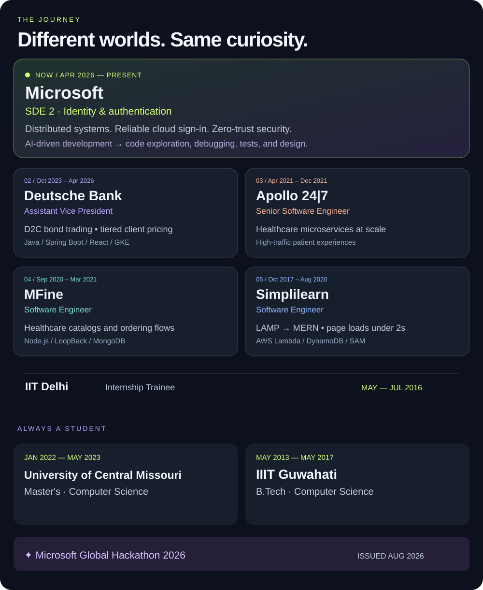

### I build the systems behind the experience.

**SDE 2 at Microsoft · Redmond, WA**  
7+ years across fintech, healthtech, and edtech.

 

Read my career and education details

**Microsoft — SDE 2** · Apr 2026–Present  
Distributed identity and authentication services, focused on reliability, scale, and zero-trust security.

**Deutsche Bank — Assistant Vice President** · Oct 2023–Apr 2026  
Tiered client pricing and bond-trading features for the D2C platform. Java, Spring Boot, React, GKE, Terraform, Splunk, and JUnit.

**Apollo 24|7 — Senior Software Engineer** · Apr 2021–Dec 2021  
Scalable healthcare microservices supporting high-traffic patient flows.

**MFine — Software Engineer** · Sep 2020–Mar 2021  
Healthcare catalog management and ordering flows with Node.js, LoopBack, and MongoDB.

**Simplilearn — Software Engineer** · Oct 2017–Aug 2020  
LAMP-to-MERN website rebuild with page loads under two seconds; serverless services on AWS.

**IIT Delhi — Internship Trainee** · May–Jul 2016

**University of Central Missouri** · Master's degree, Computer Science · Jan 2022–May 2023  
**IIIT Guwahati** · B.Tech, Computer Science · May 2013–May 2017

**Microsoft Global Hackathon 2026** · Credential issued Aug 2026

 

### Built with curiosity. Accelerated by AI.

At Microsoft, I use **AI-driven development** to explore unfamiliar codebases, debug production issues, generate unit tests, compare designs, learn new technologies, and draft documentation. I review the output and validate the changes.

 

### My everyday toolkit

**Build** &nbsp; Java · Spring Boot · Node.js · React  
**Connect** &nbsp; Kafka · Redis · MongoDB · PostgreSQL  
**Ship** &nbsp; Azure · AWS · GCP/GKE · Docker · Kubernetes · Terraform  
**Verify** &nbsp; JUnit · Splunk

 

### A few things you can explore

**[Kafka in Java ↗](https://github.com/bharath590/Kafka_Java)**  
Producers, callbacks, keyed messages, and consumers.

**[Spring + MongoDB ↗](https://github.com/bharath590/mongodb-springboot-demo)**  
Customer persistence with Spring Data MongoDB.

**[Student REST API ↗](https://github.com/bharath590/spring_rest_crud_apis)**  
Spring Boot, JPA, and MySQL in a learning project.

**[Node API ↗](https://github.com/bharath590/NodeFromScratch)**  
An Express API server with MongoDB.

 

---

**Understand the problem. Build the solution. Make it reliable.**

[Let's talk engineering ↗](https://www.linkedin.com/in/bharathmusalaya009/)

